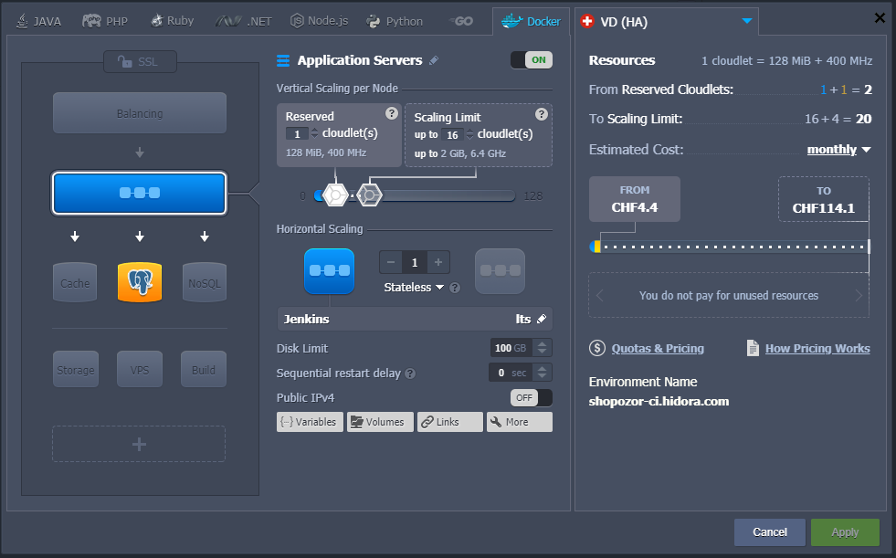
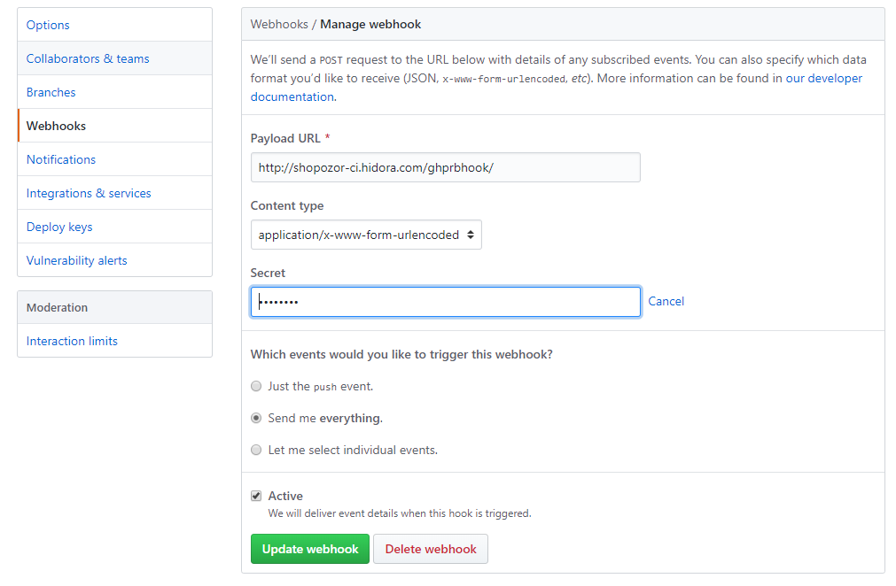
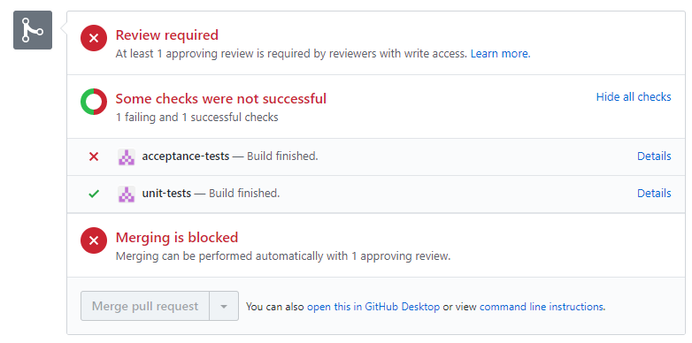
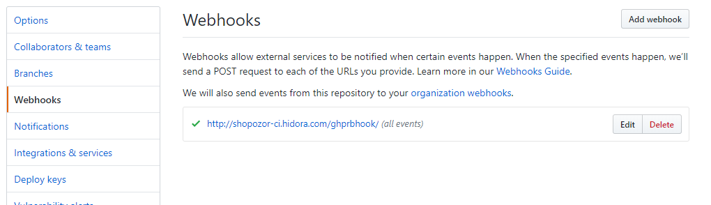
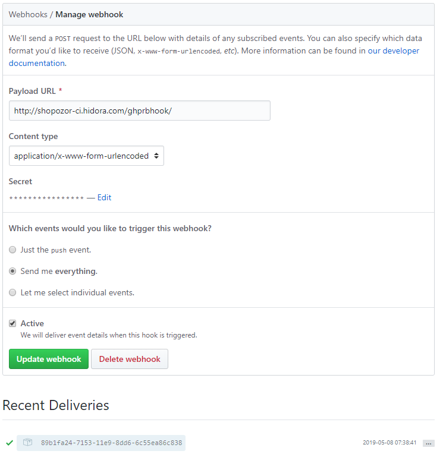

# Shopozor CI/CD configuration

Our Shopozor product needs a reliable CI/CD system. This repository consists of its configuration. In essence, we need to continuously

* unit test
* acceptance test
* end-to-end test

the Shopozor product which is split into three applications: 

1. the [backend](https://github.com/softozor/shopozor-backend)
2. the [consumer frontend](https://github.com/softozor/shopozor-consumer-frontend)
3. the [management frontend](https://github.com/softozor/shopozor-management-frontend)

This CI configuration provides following output: 

* our Github Pull Requests get feedback on the Shopozor applications' tests
* our Github repositories get feedback on the Shopozor applications' current build statuses

## Motivations

We took the decision to implement our CI/CD with Jenkins, even though there are much more sexy alternatives in the development ecosystem out there. **The main reason behind that decision is our very little development budget**. After the first release, our customer will take over the CI/CD costs.

### Why not CircleCI?

* CircleCI is very nicely integrated into Github and is very easy to configure
* The hobbyist plan is pretty restrictive on the amount of docker containers we can run within a test: it could be fine for our frontends’ acceptance tests but definitely not for our backend’s acceptance tests and all our e2e tests

### Why not Gitlab?

* External repositories not supported in the free plan
* We could host our repos on Gitlab but then we’d have to pay for its hosting, which would need to be a 24/7 hosting, making it therefore a pretty expensive choice


### Why Jenkins?

* Very easy to configure
* Completely free
* We can live with a partially available Jenkins server, some kind of on-demand Jenkins until the product's first release; as Jenkins only triggers builds, it's more than fine.

## Jenkins setup on Jelastic

In its simplest configuration, our CI environment looks like this:



It runs a [docker image of jenkins](https://hub.docker.com/r/jenkins/jenkins) as well as a Postgresql database. The database is required for some of our backend tests.

### Necessary software addtions

Out of the box, the jenkins docker image isn't provided with all the tools we need for our CI/CD. Additionally, we need the following software:

* **docker**, because we build docker images 
* **yarn**, because we build our frontend applications
* **jq**, because we interact with Jelastic environments

in our pipelines.

### Necessary Jenkins plugins

The list of necessary plugins can be found [here](config/plugins/listOfJenkinsPlugins.txt).

### Credentials setup

The Github user(s) involved in our CI/CD jobs / pipelines need to fulfill the following requirements:

- full repository permissions, in order to be able to modify pull requests
- 2FA disabled

### Github Pull Request Builder Plugin configuration

- absolutely needs ghprb shared secret: the section

```
<githubAuth>
  <org.jenkinsci.plugins.ghprb.GhprbGitHubAuth>
    <serverAPIUrl>https://api.github.com</serverAPIUrl>
    <credentialsId>GITHUB_CREDENTIAL_ID</credentialsId>
    <id>GHPRB_TRIGGER_AUTH_ID</id>
    <description>Github pull request builder</description>
    <secret>GHPRB_SHARED_SECRET</secret>
  </org.jenkinsci.plugins.ghprb.GhprbGitHubAuth>
</githubAuth>
```

of the [GhprbTrigger config](config/plugins/org.jenkinsci.plugins.ghprb.GhprbTrigger.xml) needs to be filled up with the secret provided in the Github repository's webhook:



Note that the webhook gets automatically created in the Github repository upon pull request creation. The secret will not be filled correctly though. Therefore, the first time you make a PR, no Jenkins job will be triggered, but the webhook will be created. Then you just fill it up with the relevant secret and comment the pull request with

```
retest this please
```

- the trigger phrases are documented [here](https://github.com/jenkinsci/ghprb-plugin)

The global GHPRB plugin configuration can be found [here](config/plugins/org.jenkinsci.plugins.ghprb.GhprbTrigger.xml). Upon a pull request, the repository's

* unit
* acceptance

tests are triggered. Their results is returned back to the pull request upon completion:



In the PR comments, 

* `retest this please` will run the above mentioned tests again
* `test consumer e2e` will run the consumer end-to-end tests
* `test management e2e` will run the management end-to-end tests

### Jobs setup

### Pipeline configuration

#### Global shared libraries

Because our e2e pipelines share the very same code, they can share it over the [frontend applications' common code](https://github.com/softozor/shopozor-common-frontend):

* the [common callable pipeline](https://github.com/softozor/shopozor-common-frontend/blob/dev/vars/frontendE2ePipeline.groovy)
* the [common pipeline helpers](https://github.com/softozor/shopozor-common-frontend/blob/dev/src/ch/softozor/pipeline/Helpers.groovy)

The configuration of the global shared libraries happens [here](config/plugins/org.jenkinsci.plugins.workflow.libs.GlobalLibraries.xml).

## Github repo configuration

### Github pull request builder webhook





- present branch protection setup (master & dev)
- webhook (secret + "Send me everything")
- absolutely needs ghprb shared secret


### Specific setup to our product

#### Postgres installation

## Next steps

- use Dockerfile directly in pipeline (https://jenkins.io/doc/book/pipeline/docker/#dockerfile)