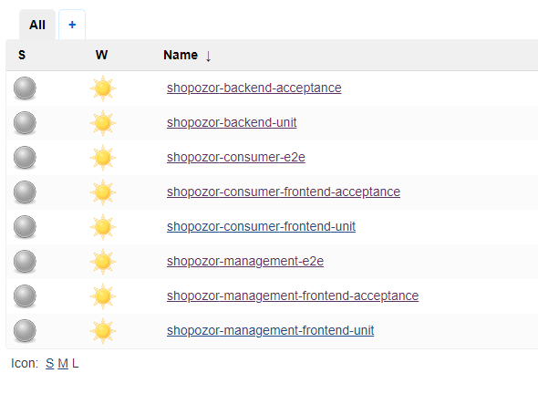
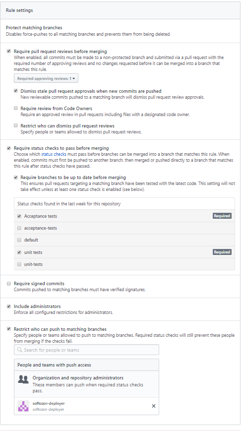
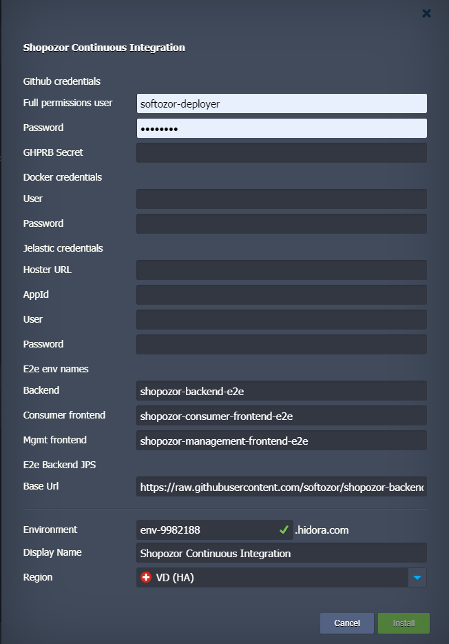

# Shopozor CI/CD configuration

Our Shopozor product needs a reliable CI/CD system. This repository consists of its configuration. In essence, we need to continuously

* unit test
* acceptance test
* end-to-end test

the Shopozor product which is split into three applications: 

1. the [backend](https://github.com/softozor/shopozor-backend)
2. the [consumer frontend](https://github.com/softozor/shopozor-consumer-frontend)
3. the [management frontend](https://github.com/softozor/shopozor-management-frontend)

This CI configuration provides following output: 

* our Github Pull Requests get feedback on the Shopozor applications' tests
* our Github repositories get feedback on the Shopozor applications' current build statuses

## Motivations

We took the decision to implement our CI/CD with Jenkins, even though there are much more sexy alternatives in the development ecosystem out there. **The main reason behind that decision is our very little development budget**. After the first release, our customer will take over the CI/CD costs.

### Why not CircleCI?

* CircleCI is very nicely integrated into Github and is very easy to configure
* The hobbyist plan is pretty restrictive on the amount of docker containers we can run within a test: it could be fine for our frontends’ acceptance tests but definitely not for our backend’s acceptance tests and all our e2e tests

### Why not Gitlab?

* External repositories not supported in the free plan
* We could host our repos on Gitlab but then we’d have to pay for its hosting, which would need to be a 24/7 hosting, making it therefore a pretty expensive choice

### Why Jenkins?

* Very easy to configure
* Completely free
* We can live with a partially available Jenkins server, some kind of on-demand Jenkins until the product's first release; as Jenkins only triggers builds, it's more than fine.

## Implemented workflows

### Isolated component integration

Each of our applications (`shopozor-backend`, `shopozor-consumer-frontend`, and `shopozor-management-frontend`) is unit- and acceptance-tested in isolation of the other components. This is done inside of the Jenkins docker container which is provided with the relevant tools (e.g. `yarn`).

### Interacting components integration

The two major use cases of our product, the Consumer and the Management use cases, are tested end-to-end. That means that all the necessary applications are started on their own Jelastic environments and the tests are run on them. The test results are then gathered from those environments and referenced on our Jenkins job.

## Jenkins setup on Jelastic

In its simplest configuration, our CI environment looks like this:


It runs a [docker image of jenkins](https://hub.docker.com/r/jenkins/jenkins) as well as a Postgresql database. The database is required for some of our backend tests.

### Necessary software additions

Out of the box, the jenkins docker image isn't provided with all the tools we need for our CI/CD. Additionally, we need the following software:

* **docker**, because we build docker images 
* **yarn**, because we build our frontend applications
* **jq**, because we interact with Jelastic environments

in our pipelines.

### Necessary Jenkins plugins

The list of necessary plugins can be found [here](config/plugins/listOfJenkinsPlugins.txt). Among others,

* **ghprb** is responsible for triggering the relevant tests on Jenkins upon pull request
* **embeddable-build-status** is responsible for making the Jenkins builds statuses available so that they can be displayed in the corresponding repositories' `README`s

### Credentials setup

The Github user(s) involved in our CI/CD jobs / pipelines need to fulfill the following requirements:

- full repository permissions, in order to be able to modify pull requests
- 2FA disabled

### Github Pull Request Builder Plugin configuration

- absolutely needs ghprb shared secret: the section

```
<githubAuth>
  <org.jenkinsci.plugins.ghprb.GhprbGitHubAuth>
    <serverAPIUrl>https://api.github.com</serverAPIUrl>
    <credentialsId>GITHUB_CREDENTIAL_ID</credentialsId>
    <id>GHPRB_TRIGGER_AUTH_ID</id>
    <description>Github pull request builder</description>
    <secret>GHPRB_SHARED_SECRET</secret>
  </org.jenkinsci.plugins.ghprb.GhprbGitHubAuth>
</githubAuth>
```

of the [GhprbTrigger config](config/plugins/org.jenkinsci.plugins.ghprb.GhprbTrigger.xml) needs to be filled up with the secret provided in the Github repository's webhook:


Note that the webhook gets automatically created in the Github repository upon pull request creation. The secret will not be filled correctly though. Therefore, the first time a PR is made, no Jenkins job will be triggered, but the webhook will be created. Then it just needs to be fed up with the relevant secret. After that, the following comment in the pull request

```
retest this please
```

will trigger the Jenkins build accordingly.

- the trigger phrases are documented [here](https://github.com/jenkinsci/ghprb-plugin)

The global GHPRB plugin configuration can be found [here](config/plugins/org.jenkinsci.plugins.ghprb.GhprbTrigger.xml). Upon a pull request, the repository's

* unit
* acceptance

tests are triggered. Their results are returned back to the pull request upon completion:


In the PR comments, 

* `retest this please` will run the above mentioned tests again
* `test consumer e2e` will run the consumer end-to-end tests
* `test management e2e` will run the management end-to-end tests

### Jobs setup

The jobs are setup automatically by means of the Jenkins CLI. Their configuration can be found in `config/shopozor-*.xml`:



### Pipeline configuration

Jenkins pipelines can nicely be configured by code. Extensive documentation can be found [here](https://jenkins.io/doc/book/pipeline/).

#### Global shared libraries

Because our e2e pipelines share the very same code, they can do so over the [frontend applications' common code](https://github.com/softozor/shopozor-common-frontend):

* the [common callable pipeline](https://github.com/shopozor/jenkins-shared-library/blob/master/vars/frontendE2ePipeline.groovy)
* the [common pipeline helpers](https://github.com/shopozor/jenkins-shared-library/blob/master/src/ch/softozor/pipeline/Helpers.groovy)

The configuration of the global shared libraries happens [here](config/plugins/org.jenkinsci.plugins.workflow.libs.GlobalLibraries.xml).

## Github repo configuration

### Branch protection rules

Any push to our `master` or `dev` branch will be rejected, except it was initiated by our `softozor-deployer` user:



### GHPRB webhook setup

As soon as a pull request is issued, the webhook is automatically added to the repository's webhooks:


It is critical that the webhook's secret be filled with the corresponding value set in Jenkins global configuration of the GHPRB plugin. In addition, the webhook needs to be triggered by **everything**.


The list of recent deliveries clearly shows whether the webhook gets triggered and with what payload and result.

## Typical Jelastic configuration

The Jelastic installation requires following form to be filled:



## End to end testing

Assume `backend-feature-branch` of backend has breaking changes, i.e. it is expected that at least one of the frontends won't integrate nicely any more with it. Then, when you merge `backend-feature-branch` into `dev` with a PR, then the e2e tests will fail with the frontend's `dev` branch. 

The frontend should therefore create a `frontend-feature-branch` to adapt to the backend's breaking changes. When we merge `frontend-feature-branch` into `dev` with a new PR, the e2e tests will fail to integrate with the backend's `dev` branch. The feature branch of one repository can only test against the `dev` branch of the other if we want to automate that merging process somehow. Indeed, if you make a PR in the backend from `backend-feature-branch` to `dev`, then the Jenkins job can only know that you are on the backend and you would like to perform e2e testing. It knows nothing about the state of the frontend repositories. That information cannot be transmitted to the Jenkins job for the backend e2e tests either. 
Because of that, we get into some kind of bottleneck, because we can never merge a feature branch into `dev` if we activate e2e testing in that process. 

Therefore, no e2e test should be performed upon feature completion in one or the other separate repository. e2e tests should be performed upon merges from `dev` to `master`. 

In that situation, assume the backend has breaking changes in its `dev` branch. Upon merging into `master` with a PR, the e2e tests will fail with the `dev` branch of at least one of our frontends. The frontend should therefore create `feature-branch` to adapt to the new backend's breaking changes. Upon merging the frontend's `feature-branch` into `dev` with a PR, the e2e tests should pass when tested against the backend's `dev` branch. At that point, both the backend and the frontend are ready to be merged into `master`. That way, we ensure that whatever we have in our `master` branches, interactions between the various applications will work.

Of course, that bases on the reasonable assumption that before merging into `master`, all interactions between the apps are working in their `master` branches. Then, if the interactions in their `dev` branches are working (as tested by the e2e tests), then they should also work after merging into `master`.

Example merging process from `dev` to `master`:

1) merge backend --> e2e tests are run: backend - consumer frontend, backend - management frontend 
if not passing, then adapt consumer and mgmt frontends until their `dev` branches make the tests pass
2) merge consumer frontend --> e2e tests are run: backend - consumer frontend  --> should pass 
3) merge management frontend --> e2e tests are run: backend - management frontend --> should pass 

In the GHPRB, it is possible to only enable the e2e tests when merging to `master`. 